# Creating Commands

Custom commands give users the ability to create a command with their desired response. 

To create a custom command, navigate to the Commands tab on the sidebar:

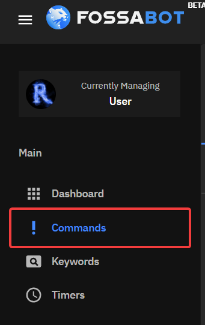

After click the Create button in the top right corner:

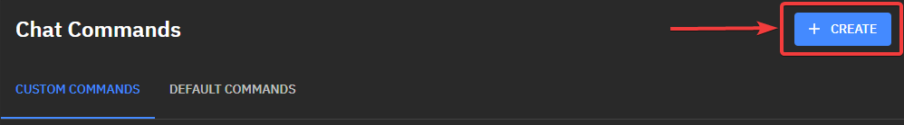

### Creating a Simple Command

Start by adding the command name. This is the command that will be used in chat:

Response is what you would like to be sent to chat. This can include normal text but also utilize variables:

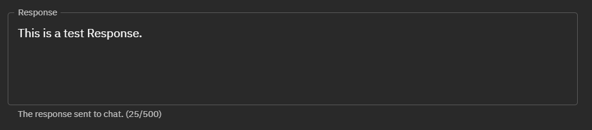

When your command is finished, click the Save button in the button right corner:

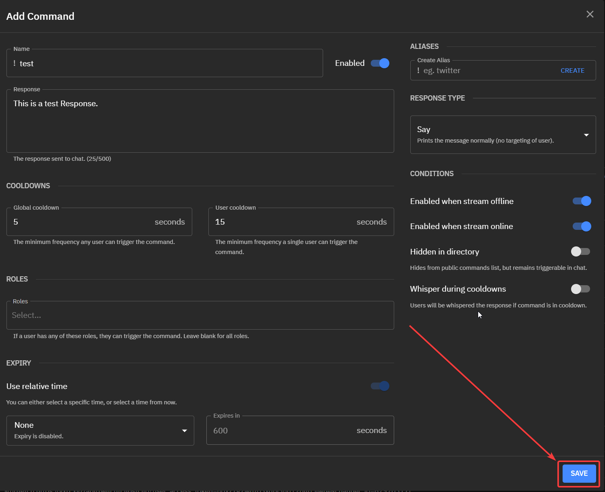

## Cooldowns

Cooldowns are essential to controlling how often a command is used and to avoid spam in chat.

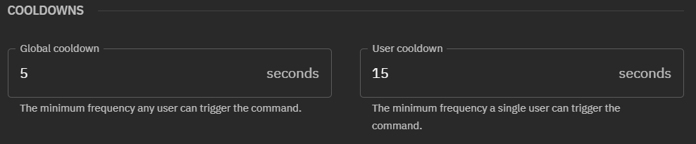

### Global Cooldowns

Global cooldowns are the minimum frequency a command can be triggered by any user in chat. 

If a single user triggers a command, the **entire** chat must wait until the cooldown is over until this command can be triggered again.

### User Cooldowns

User Cooldowns are the minimum frequency a single user trigger a command. 

If User-A triggers a command they must wait X amount of seconds before they can trigger the command again. User-B can still trigger the command.

## Aliases

A command alias is used to add another command name without creating a new custom command.

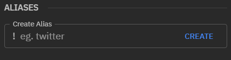

Create an alias by typing in the box and using the Enter key on your keyboard or the Create button. Click the X on the alias to delete it.

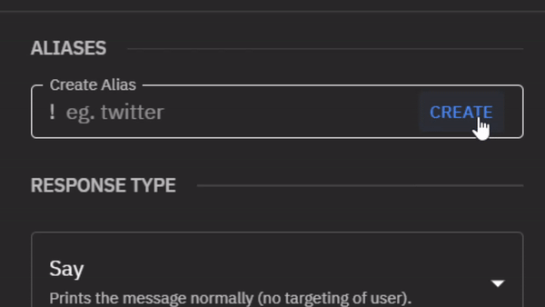

## Response Type

Response type defines how Fossabot answers commands.

Fossabot has 4 response types, Say, Mention, Reply, and Whisper. 

### Say

Say will print the command response normally in chat:

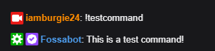

### Mention

Mention will Mention the user in the command response:

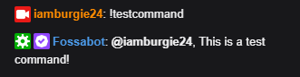

### Reply

Reply uses [Twitch's chat reply feature](https://help.twitch.tv/s/article/chat-basics?language=en_US#replies) to send the command response.

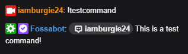 

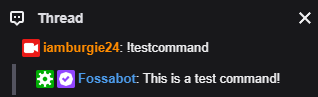

### Whisper

Whisper will send the user a direct message with the command response.

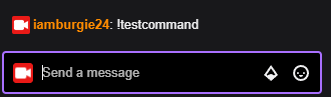 

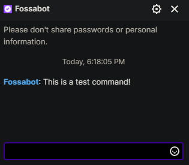

## Roles

Roles allow you to set who can trigger a command. Select one or more role from the dropdown menu that will be able to trigger a command.

:::info
If no roles are selected, the command is triggerable by all users
:::

## Conditions

Conditions are options that affect how the command may work.

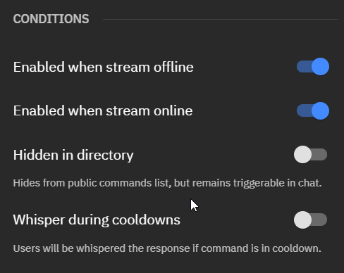

#### Enabled when stream offline

This toggle changes if this command is triggerable while the stream is offline.

#### Enabled when stream online

This toggle changes if this command is triggerable while the stream is online.

#### Hidden in directory

Removes command from public command list. Command is still triggerable in chat.

#### Whisper during cooldowns

If the command is on cooldown, The user will be whispered with the response.

## Expiry 

Expiry disables or deletes a command after a specific time or a selected time and date. Expiry is disabled by default.

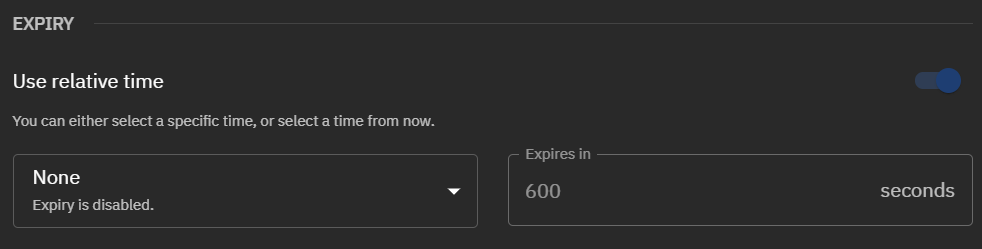

To enable Expiry, first choose if the command should be disabled or deleted.

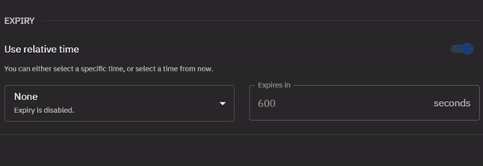

When using relative time, set the number of seconds until the timer expires. Otherwise set the expire time with a date and time.

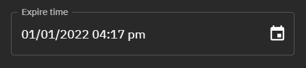