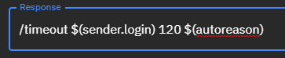

# $(autoreason)

`$(autoreason)` is a special variable **only available in keywords**. It resolves which phrase group within a given keyword was matched: `Matched phrase group {x} in Keyword {y}`.

This is particularly useful if you have made a keyword for moderation, and would like to know which specific phrase group triggered a timeout, for debugging etc.

You can add this in the `Keyword response` section, for example in a moderation keyword like so:

