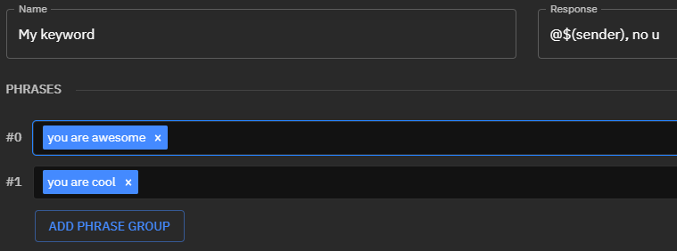

# Phrase Groups

Phrase groups allow you to define a set of phrases that must be matched in order to trigger a keyword. Every single phrase within a given phrase group **must** match, else Fossabot will continue to match other groups.

You can have multiple phrase groups per keyword, which act as "OR" statements for triggering a keyword. Phrase groups are by default fuzzy-matched and case-insensitive, but there are optional flags that allow you to customize the matching behaviour of a given phrase:

## Adding a phrase to a group

To add a phrase to a phrase group, simply click inside a phrase group:

Then type the phrase into the input:

Finally, hit the **return key on your keyboard** to add it to the phrase:

You should see the phrase in a blue tag, this means it has been added to the keyword phrase group.

## Using phrase groups

Consider the following phrase group:

This phrase group will trigger if `you`, `are` and `awesome` appear **anywhere** in the message content. So `you are awesome` could match, but so could `awesome are you` or even `you are not awesome`. This also ignores spaces, so `you're aren't awesomest` would also be matched by Fossabot.

However, you could combine these phrases into a single phrase:

Then Fossabot would match `you are awesome!!`, but **not** `you are not awesome` - as the entire phrase block is not able to be matched **anywhere** in `you are not awesome`.

## Multiple phrase groups

Assuming a use case where you would like to match `you are awesome` or `you are cool`, it may be your first instinct to do something like this:

However, **this is incorrect!** You are asking Fossabot to only match content that contains **both** `you are cool` **AND** `you are awesome`. You will want to create multiple phrase groups to create an `OR` condition, where instead you ask Fossabot to match if **either** phrase exists.

Click the `Add Phrase Group` button, it will add another input, and move `you are cool` into the below phrase group like so:

This will then match if **either** `you are cool` OR `you are awesome` is contained within the message content!
