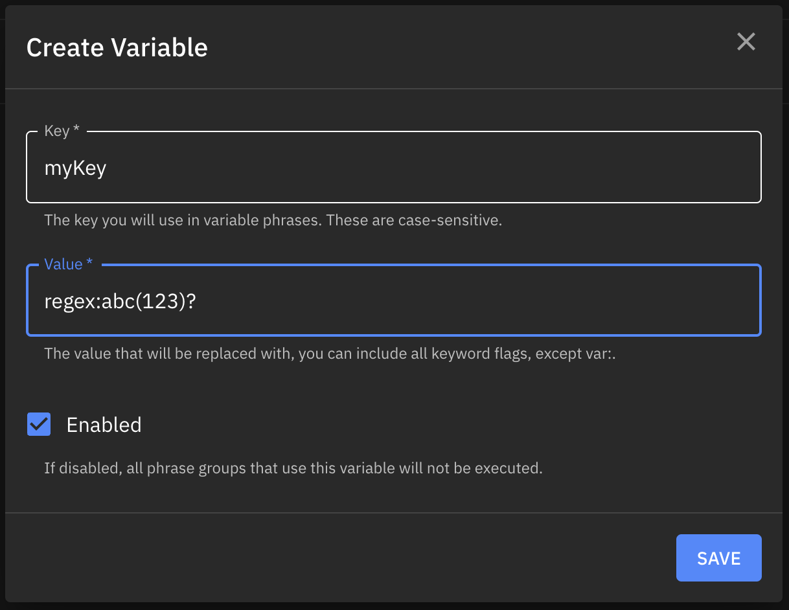
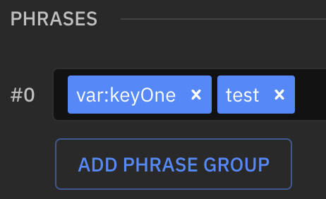
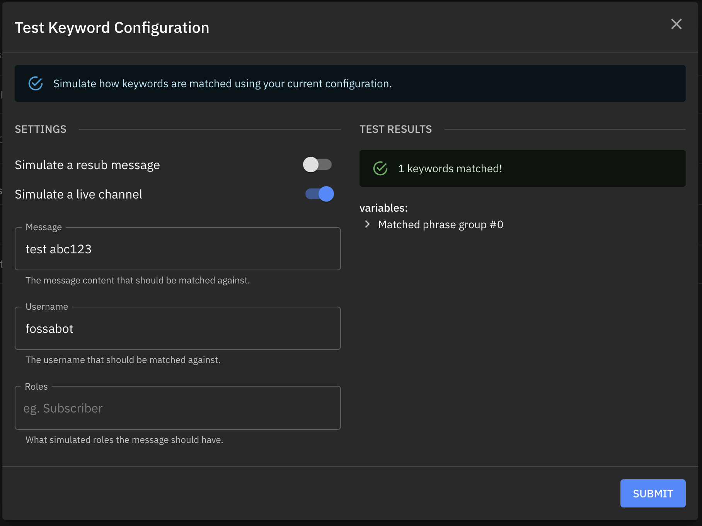

# Variables

:::caution Disabling the variable will disable the **phrase group entirely**.

For example, the below keyword phrase group will *not* work if I disable the variable. All other phrases within the group are ignored.

:::

:::caution Deleting the variable will disable the **phrase group entirely**.

For example, the below keyword phrase group will *not* work if I delete the variable. All other phrases within the group are ignored.

:::

Variables provide a way for you to define common phrases within multiple keywords. By using the `var:` flag on a phrase, it will reference the stored variable value when parsing your keyword phrase.

For example, lets define a variable with a key of `myKey`, and a value of `regex:abc(123)?`:

Then, lets use it in a keyword:

You are now able to match `test abc` or `test abc123` in your keyword:

