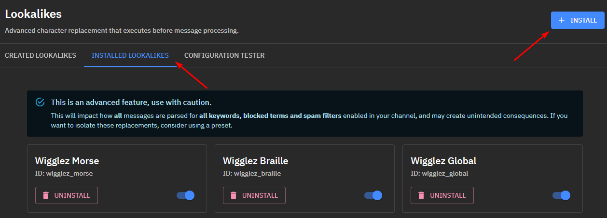
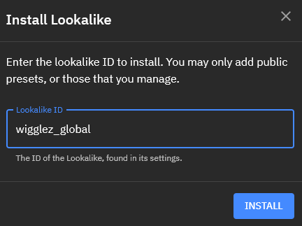

# Installing Lookalikes

Under the category `Installed Lookalikes`, you will see all the lookalikes that are currently installed on your channel or preset. By default, you will have no installed lookalikes, including the ones you may have created.

Each lookalike can be disabled at a local level that will not impact anyone else's status of this lookalike.

You can also uninstall lookalikes that you no longer wish to use.

## Install Lookalike

Ensure that you install lookalikes in the order that you want them to be processed, from left to right. In the example image below, you can see I have wigglez_morse enabled first, which will replace any morse code to Latin (English) characters, and then pass that result on to the next lookalike.

Press the `INSTALL` button and enter the `ID` of the lookalike you wish to install.

### Restrictions

If the lookalike is not publicly enabled, it will only be possible to install on the channel or preset the lookalike was created.

If the lookalike is public, it can be installed on all channels and presets
  

