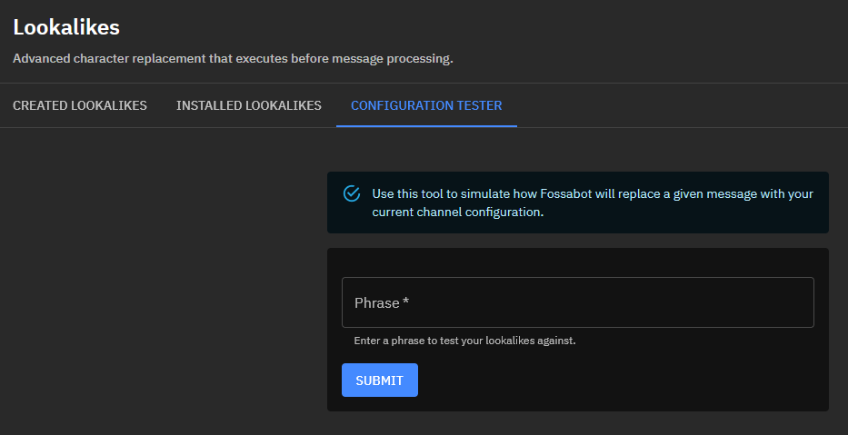
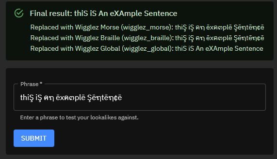

# Configuration Tester

The configuration tester is a simple way to test against all installed (and enabled) lookalikes on this channel or preset.

## Ensure Lookalikes are Installed

The currently installed and enabled lookalikes on my channel for this test are `wigglez_morse`, `wigglez_braille`, and `wigglez_global`.

## Enter a Test Phrase

I'm going to enter the test phrase `thiŞ iŞ คຖ ēxค๓plē Şēຖtēຖ¢ē` and press the `SUBMIT` button.

## Results

You can see that the `wigglez_morse` and `wigglez_braille` lookalikes do not modify the message because nothing was matched.

After the message passed `wigglez_global`, the message is now able to be processed by a blocked term or keyword that looks for `this is an example sentence`.
