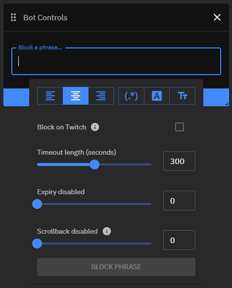
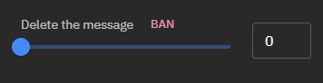
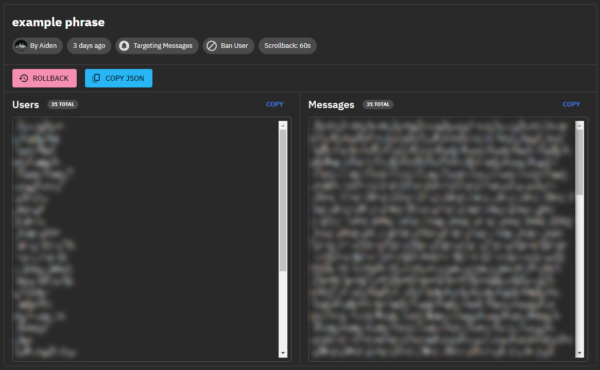

# Usage

Nukes can be executed in either of two ways - one, via the dashboard and the built-in GUI or two, via a default chat command.

## Graphical User Interface

The GUI is part of the **Bot Controls** panel on your main dashboard and can be brought up by clicking into the `Block a phrase...` text field, it looks as follows:

This GUI provides various 1-click solutions to match simple phrases, but also more advanced patterns such as regular expressions without any deeper knowledge. Hovering over each button will explain its effects and usage.

Just below that you can find a checkbox labeled `Block on Twitch` that if checked causes the specified phrase or term to be added to [**Twitch's Blocked Terms**](https://help.twitch.tv/s/article/how-to-use-automod?language=en_US#BlockedandPermitted) in addition to the enforcement configured below.

Furthermore you can see three different sliders that can easily be dragged to a desired length. These can also be controlled by typing in an amount of seconds in the text fields next to each one.

* **Timeout length** - *How long the sender of a nuked messaged should be timed out for (in seconds)*

  * A value of `0` will delete the message
    * This will also bring up a `BAN` button that if pressed changes the enforcement from ***delete*** to ***ban*** instead
    
  * A value of `1 - 600` will time the user out for the specified amount of seconds

* **Expiry** - *If and how long a nuke should be active for (in seconds)*

  * A value of `0` will disable the expiration and means the nuke has to be disabled manually
  * A value of `1 - 600` will disable the nuke after the specified amount of seconds

* **Scrollback** - *If and how far Fossabot should look back in chat (in seconds)*

  * A value of `0` will disable the scrollback and only messages sent after a nuke was executed will be considered
  * A value of `1 - 600` will consider all messages sent before the nuke was executed, up to the specified amount of seconds

After successful configuration you can now execute the nuke by pressing the `BLOCK PHRASE` button.

## Chat Command

In addition to the GUI explained above, nukes can also be executed via the default chat command `!nuke`. This command offers the exact same feature set as the GUI above, apart from the ability to add phrases or terms to [**Twitch's Blocked Terms**](https://help.twitch.tv/s/article/how-to-use-automod?language=en_US#BlockedandPermitted).

This command has the following syntax:
> `!nuke <phrase|/RegExp/> <scrollback> <timeout|delete|ban>`

### Example Usage

* `!nuke my bad phrase 3m 10m`

    Every message of the past ***3 minutes*** before execution containing the phrase `my bad phrase` will be timed out for ***10 minutes***.

* `!nuke example phrase 5m delete`

    Every message of the past ***5 minutes*** before execution containing the phrase `example phrase` will be ***deleted***.

* `!nuke /some.+bad(regex)?here/ 2m ban`

    Every message of the past ***2 minutes*** before execution containing a match to the regular expression `some.+bad(regex)?here` will cause the message sender to be ***banned***.

Radiation is also supported and has the following syntax:
> `!nuke <phrase|/RegExp/> -r=<length> <scrollback> <timeout|delete|ban>`

### Example Usage With Radiation

* `!nuke my bad phrase -r=5m 3m 10m`

    Every message of the past ***3 minutes*** before execution containing the phrase `my bad phrase` will be timed out for ***10 minutes***. In addition to that, this will also be enforced against every future message for the next ***5 minutes***.

* `!nuke example phrase -r=10m 5m delete`

    Every message of the past ***5 minutes*** before execution containing the phrase `example phrase` will be ***deleted***. In addition to that, this will also be enforced against every future message for the next ***10 minutes***.

* `!nuke /some.+bad(regex)?here/ -r=1m 2m ban`

    Every message of the past ***2 minutes*** before execution containing a match to the regular expression `some.+bad(regex)?here` will cause the message sender to be ***banned***. In addition to that, this will also be enforced against every future message for the next ***1 minute***.

## After Execution

After each nuke you will be whispered by Fossabot. This whisper includes a link to a detailed report of the nuke and the name of the channel that it was executed in. Following this link will bring you to the channel's dashboard and the report of your nuke, as well as several quick actions that allow you to either reverse it (`ROLLBACK`), or copy certain information to your clipboard (`COPY JSON`).

